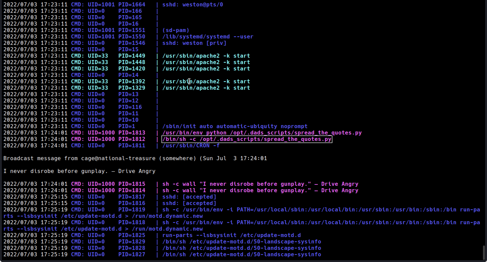

<head>
<h1><center>Break Out The Cage</center></h1>
</head>

## Description

Let's find out what his agent is up to....

<br>

## Enumeration

We are provided with the IP of the machine.

<br>

### Port Scan

&nbsp;&nbsp;Basic port scan shows that there are three open ports on the machine.

```
PORT   STATE SERVICE VERSION
21/tcp open  ftp     vsftpd 3.0.3
| ftp-anon: Anonymous FTP login allowed (FTP code 230)
|_-rw-r--r--    1 0        0             396 May 25  2020 dad_tasks
| ftp-syst: 
|   STAT: 
| FTP server status:
|      Connected to ::ffff:10.17.57.3
|      Logged in as ftp
|      TYPE: ASCII
|      No session bandwidth limit
|      Session timeout in seconds is 300
|      Control connection is plain text
|      Data connections will be plain text
|      At session startup, client count was 4
|      vsFTPd 3.0.3 - secure, fast, stable
|_End of status
22/tcp open  ssh     OpenSSH 7.6p1 Ubuntu 4ubuntu0.3 (Ubuntu Linux; protocol 2.0)
| ssh-hostkey: 
|   2048 dd:fd:88:94:f8:c8:d1:1b:51:e3:7d:f8:1d:dd:82:3e (RSA)
|   256 3e:ba:38:63:2b:8d:1c:68:13:d5:05:ba:7a:ae:d9:3b (ECDSA)
|_  256 c0:a6:a3:64:44:1e:cf:47:5f:85:f6:1f:78:4c:59:d8 (ED25519)
80/tcp open  http    Apache httpd 2.4.29 ((Ubuntu))
|_http-server-header: Apache/2.4.29 (Ubuntu)
|_http-title: Nicholas Cage Stories
Service Info: OSs: Unix, Linux; CPE: cpe:/o:linux:linux_kernel
```

#### Port 80

&nbsp;&nbsp;&nbsp;Going over to the port 80 shows a home page of a blog.


All the links in the webpage redirects to the same home page.

#### Port 21

It is clearly visible from the port scan that ftp is allowing anonymous login.
After login we see the file `dad_tasks`

```
UWFwdyBFZWtjbCAtIFB2ciBSTUtQLi4uWFpXIFZXVVIuLi4gVFRJIFhFRi4uLiBMQUEgWlJHUVJPISEhIQpTZncuIEtham5tYiB4c2kgb3d1b3dnZQpGYXouIFRtbCBma2ZyIHFnc2VpayBhZyBvcWVpYngKRWxqd3guIFhpbCBicWkgYWlrbGJ5d3FlClJzZnYuIFp3ZWwgdnZtIGltZWwgc3VtZWJ0IGxxd2RzZmsKWWVqci4gVHFlbmwgVnN3IHN2bnQgInVycXNqZXRwd2JuIGVpbnlqYW11IiB3Zi4KCkl6IGdsd3cgQSB5a2Z0ZWYuLi4uIFFqaHN2Ym91dW9leGNtdndrd3dhdGZsbHh1Z2hoYmJjbXlkaXp3bGtic2lkaXVzY3ds
```

<br>

## Dad Taks

This is a base64 encoded message.
Using [Cyberchef](https://gchq.github.io/CyberChef/) we can decode to see a vigenere encoded text.
Bruteforcing it using [Boxentric](https://www.boxentriq.com/code-breaking/vigenere-cipher) we find the key is `namelesstwo`

```
Dads Tasks - The RAGE...THE CAGE... THE MAN... THE LEGEND!!!!
One. Revamp the website
Two. Put more quotes in script
Three. Buy bee pesticide
Four. Help him with acting lessons
Five. Teach Dad what "information security" is.

In case I forget.... Mydadisghostrideraintthatcoolnocausehesonfirejokes
```

We get password for the user `weston`

```
Mydadisghostrideraintthatcoolnocausehesonfirejokes
```

<br>

## SSH

After logging in as `weston` we start our fundementals

users

```
1. root
2. cage
3. weston
```

sudo -l

```
User weston may run the following commands on national-treasure:
    (root) /usr/bin/bees
```

Checking the program `/usr/bin/bees` is of no use.

But there was a script that is running everey 3 minutes.
Then I checked `/etc/crontab` but no use.

Using [pspy](https://github.com/DominicBreuker/pspy/releases/download/v1.2.0/pspy64s) we can see the script running..



<br>

## Script

The path of the script is at `/opt/.dads_scripts/spread_the_quotes.py`
It is being run as the user `cage`

```
#!/usr/bin/env python

#Copyright Weston 2k20 (Dad couldnt write this with all the time in the world!)
import os
import random

lines = open("/opt/.dads_scripts/.files/.quotes").read().splitlines()
quote = random.choice(lines)
os.system("wall " + quote)
```

Now at this point we have write access to `.quotes`

I deleted all the lines in `.quotes` and added a reverse shell using socat

<br>

## Cage

Now in the home directory of cage we have a file `Super_Duper_Checklist`

```
1 - Increase acting lesson budget by at least 30%
2 - Get Weston to stop wearing eye-liner
3 - Get a new pet octopus
4 - Try and keep current wife
5 - Figure out why Weston has this etched into his desk: THM{M37AL_0R_P3N_T35T1NG}
```

One more directory `email_backup` which has 3 emails..

```
From - SeanArcher@BigManAgents.com
To - Cage@nationaltreasure.com

Hey Cage!

There's rumours of a Face/Off sequel, Face/Off 2 - Face On. It's supposedly only in the
planning stages at the moment. I've put a good word in for you, if you're lucky we 
might be able to get you a part of an angry shop keeping or something? Would you be up
for that, the money would be good and it'd look good on your acting CV.

Regards

Sean Archer
```

```
From - Cage@nationaltreasure.com
To - SeanArcher@BigManAgents.com

Dear Sean

We've had this discussion before Sean, I want bigger roles, I'm meant for greater things.
Why aren't you finding roles like Batman, The Little Mermaid(I'd make a great Sebastian!),
the new Home Alone film and why oh why Sean, tell me why Sean. Why did I not get a role in the
new fan made Star Wars films?! There was 3 of them! 3 Sean! I mean yes they were terrible films.
I could of made them great... great Sean.... I think you're missing my true potential.

On a much lighter note thank you for helping me set up my home server, Weston helped too, but
not overally greatly. I gave him some smaller jobs. Whats your username on here? Root?

Yours

Cage
```

```
From - Cage@nationaltreasure.com
To - Weston@nationaltreasure.com

Hey Son

Buddy, Sean left a note on his desk with some really strange writing on it. I quickly wrote
down what it said. Could you look into it please? I think it could be something to do with his
account on here. I want to know what he's hiding from me... I might need a new agent. Pretty
sure he's out to get me. The note said:

haiinspsyanileph

The guy also seems obsessed with my face lately. He came him wearing a mask of my face...
was rather odd. Imagine wearing his ugly face.... I wouldnt be able to FACE that!! 
hahahahahahahahahahahahahahahaahah get it Weston! FACE THAT!!!! hahahahahahahhaha
ahahahhahaha. Ahhh Face it... he's just odd. 

Regards

The Legend - Cage
```

Here we get to know that the user `root` is Sean.
And his password `haiinspsyanileph` is encoded with vigenere cipher and key `face`

```
cageisnotalegend
```

We can switch user to root..💀

<br>

## Root flag

In `/root/email_backup` we see two emails..

```
From - SeanArcher@BigManAgents.com
To - master@ActorsGuild.com

Good Evening Master

My control over Cage is becoming stronger, I've been casting him into worse and worse roles.
Eventually the whole world will see who Cage really is! Our masterplan is coming together
master, I'm in your debt.

Thank you

Sean Archer
```

```
From - master@ActorsGuild.com
To - SeanArcher@BigManAgents.com

Dear Sean

I'm very pleased to here that Sean, you are a good disciple. Your power over him has become
strong... so strong that I feel the power to promote you from disciple to crony. I hope you
don't abuse your new found strength. To ascend yourself to this level please use this code:

THM{8R1NG_D0WN_7H3_C493_L0N9_L1V3_M3}

Thank you

Sean Archer
```